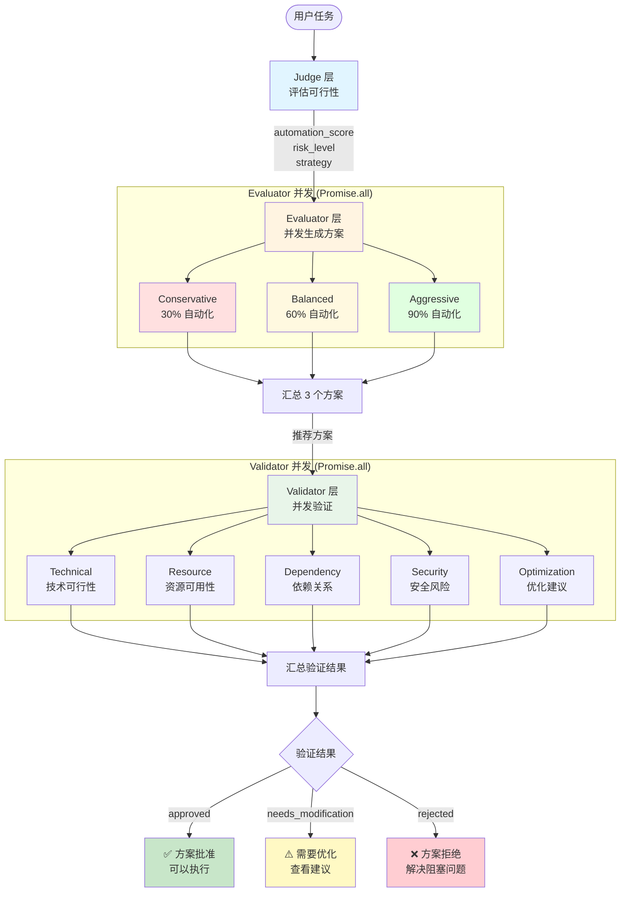
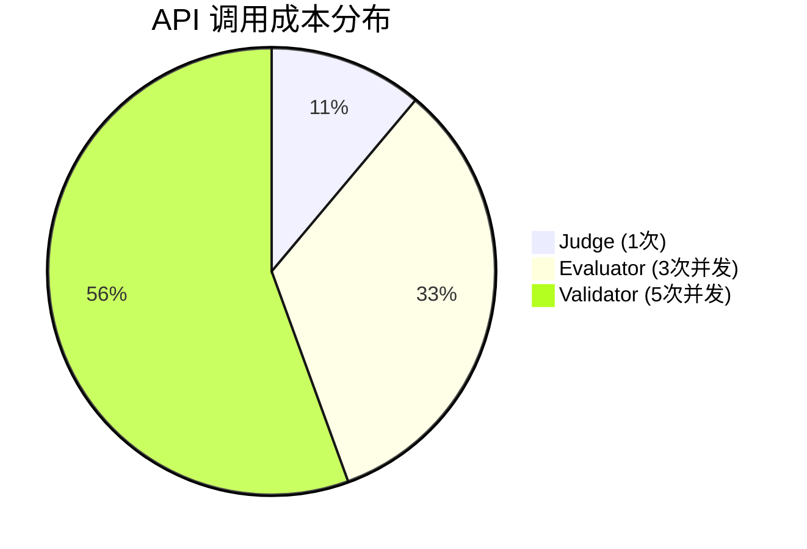

```mermaid
graph TB
    Start([用户任务]) --> Judge[Judge 层<br/>评估可行性]
    
    Judge --> |automation_score<br/>risk_level<br/>strategy| Evaluator[Evaluator 层<br/>并发生成方案]
    
    subgraph "Evaluator 并发 (Promise.all)"
        Evaluator --> E1[Conservative<br/>30% 自动化]
        Evaluator --> E2[Balanced<br/>60% 自动化]
        Evaluator --> E3[Aggressive<br/>90% 自动化]
    end
    
    E1 --> Merge1[汇总 3 个方案]
    E2 --> Merge1
    E3 --> Merge1
    
    Merge1 --> |推荐方案| Validator[Validator 层<br/>并发验证]
    
    subgraph "Validator 并发 (Promise.all)"
        Validator --> V1[Technical<br/>技术可行性]
        Validator --> V2[Resource<br/>资源可用性]
        Validator --> V3[Dependency<br/>依赖关系]
        Validator --> V4[Security<br/>安全风险]
        Validator --> V5[Optimization<br/>优化建议]
    end
    
    V1 --> Merge2[汇总验证结果]
    V2 --> Merge2
    V3 --> Merge2
    V4 --> Merge2
    V5 --> Merge2
    
    Merge2 --> Decision{验证结果}
    
    Decision --> |approved| Approved[✅ 方案批准<br/>可以执行]
    Decision --> |needs_modification| Modified[⚠️ 需要优化<br/>查看建议]
    Decision --> |rejected| Rejected[❌ 方案拒绝<br/>解决阻塞问题]
    
    style Judge fill:#e1f5ff
    style Evaluator fill:#fff4e1
    style Validator fill:#e8f5e9
    style E1 fill:#ffe0e0
    style E2 fill:#fff9e0
    style E3 fill:#e0ffe0
    style V1 fill:#f0f0ff
    style V2 fill:#f0f0ff
    style V3 fill:#f0f0ff
    style V4 fill:#f0f0ff
    style V5 fill:#f0f0ff
    style Approved fill:#c8e6c9
    style Modified fill:#fff9c4
    style Rejected fill:#ffcdd2
```

## 并发优化效果

```mermaid
gantt
    title 串行 vs 并发延迟对比
    dateFormat X
    axisFormat %L
    
    section 串行实现
    Judge (6s)         :0, 6000
    Evaluator 1 (6s)   :6000, 12000
    Evaluator 2 (6s)   :12000, 18000
    Evaluator 3 (6s)   :18000, 24000
    Validator 1 (3s)   :24000, 27000
    Validator 2 (3s)   :27000, 30000
    Validator 3 (3s)   :30000, 33000
    Validator 4 (3s)   :33000, 36000
    Validator 5 (3s)   :36000, 39000
    
    section 并发实现
    Judge (6s)                    :0, 6000
    Evaluator 并发 (6s)           :6000, 12000
    Validator 并发 (3s)           :12000, 15000
```

**并发收益**: 串行 39s → 并发 15s，**节省 62%**

## 成本分析

```mermaid
pie title API 调用成本分布
    "Judge (1次)" : 1
    "Evaluator (3次并发)" : 3
    "Validator (5次并发)" : 5
```

**总成本**: ~$0.000036 / 任务（DeepSeek v4.1 Flash）

**并发不增加成本**: 并发只优化延迟，API 调用次数不变
